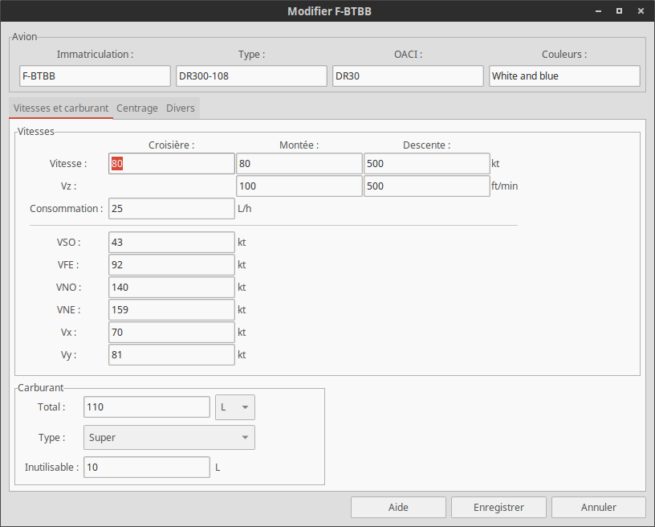

# Historique

**_2015/09/15_, v0.7 :**  
Je commence à bien aimer écrire ces petites notes de mise à jour personnellement. Aujourd'hui, la **0.7** est de sortie ! :smiley:  
Quoi de neuf ? Visuellement pas grand chose et niveau des fonctionnalitées non plus. Mais au niveau du code, il y a eu pas mal de changement. Toutes les fenêtres utilisent désormais un fichier ```.glade```, ce qui va simplifier le travail de traduction et éviter de me prendre la tête avec ces histoires de layout. Le hangar et l'éditeur d'avion passe en fenêtre modale, pour pouvoir recharger la liste des avions quand elles sont fermés. Passage d'OpenPlane sous *GNU GPL 3*, ça fait classe ! :grin:. Amélioration du graphique de masse et centrage, il vous indique quand il n'est pas valide. Les chemins des fichiers sont rassemblés dans un seul et même fichier, ```config.py```, un pas de plus vers le multi-plateforme. Ajout d'un logo fait par [Blackline](https://zestedesavoir.com/membres/voir/Blackline/). Tous les textes affichés qui sont générés *à la main* se retrouve dans un fichier ```text.py```, encore une fois pour faciliter les traductions. Et enfin, tous les boutons *basiques* du genre "Fermer", "Enregistrer", "Ajouter"... Utilisent un format *universel*, ils sont automatiquement traduits, je n'ai plus rien à faire pour ceux-là.  

Comme vous pouvez le constater, je n'ai pas chomé pour cette version. Je pense que la version **0.8** apportera une nouvelle fenêtre, mais je n'en dit pas plus pour le moment. :stuck_out_tongue_closed_eyes:

**_2015/09/13_, v0.6 :**  
Ajout de la fenêtre du devis de masse et centrage avec prévisualisation, *s'il vous plaît*. Le graphique est généré par *pyplot* et peut être exporté en *.png* (recommandé) ou autre format d'image supporté par *pyplot*. Voici un exemple de de devis généré par OpenPlane (avouez qu'il en jette! :grin:) : 


**_2015/09/12_, v0.5 :**  
Remaniement complet de l'interface de l'éditeur d'avions, qui se présente maintenant sous forme d'onglet et ajout des valeurs de centrage. Plus qu'à ajouter une nouvelle fenêtre pour générer le devis de masse et centrage. Vraiment fier de mon travail ! :muscle:


**_2015/09/12_, v0.4 :**  
Hangar terminé et ajouté à la fenêtre principale, publication du projet sur [Github](https://github.com/boopr/OpenPlane) avec le message *"First commit! :tada:"* et écriture de cet historique.

**_2015/09/10_, v0.3 :**  
Dernière fonctionnalité de l'éditeur d'avions ajoutées (notamment importer des avions), je commence à réfléchir au hangar.

**_2015/09/09_, v0.2 :**  
Ajout de la fenêtre principale et commencement de l'éditeur d'avions. Le fichier le plus lourd que j'ai eu à faire jusqu'ici ! 

**_2015/09/08_, v0.1 :**  
Création du convertisseur (fichier gui et fonctions de conversion).  
Début du projet ! :smiley:
