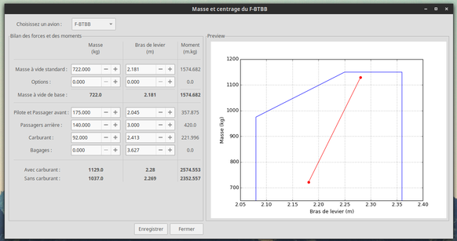
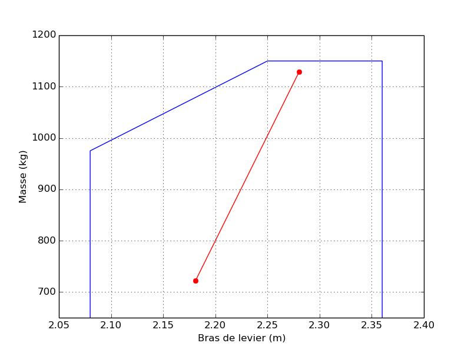

# OpenPlane

# Screenshots

# Historique

**_2015/09/13_, v0.6 :**  
Ajout de la fenêtre du devis de masse et centrage avec prévisualisation, *s'il vous plaît*. Le graphique est généré par *pyplot* et peut être exporté en *.png* (recommandé) ou autre format d'image supporté par *pyplot*. Voici un exemple de de devis généré par OpenPlane (avouez qu'il en jette! :grin:) : 

**_2015/09/12_, v0.5 :**  
Remaniement complet de l'interface de l'éditeur d'avions, qui se présente maintenant sous forme d'onglet et ajout des valeurs de centrage. Plus qu'à ajouter une nouvelle fenêtre pour générer le devis de masse et centrage. Vraiment fier de mon travail ! :muscle:

**_2015/09/12_, v0.4 :**  
Hangar terminé et ajouté à la fenêtre principale, publication du projet sur [Github](https://github.com/boopr/OpenPlane) avec le message *"First commit! :tada:"* et écriture de cet historique.

**_2015/09/10_, v0.3 :**  
Dernière fonctionnalité de l'éditeur d'avions ajoutées (notamment importer des avions), je commence à réfléchir au hangar.

**_2015/09/09_, v0.2 :**  
Ajout de la fenêtre principale et commencement de l'éditeur d'avions. Le fichier le plus lourd que j'ai eu à faire jusqu'ici ! 

**_2015/09/08_, v0.1 :**  
Création du convertisseur (fichier gui et fonctions de conversion).  
Début du projet ! :smiley:

# Todo
- METAR/TAF
- Masse et centrage à partir des données des avions (utilisation intensive de matplotlib, que je ne connais pas du tout)
- Carnet de vol numérique
