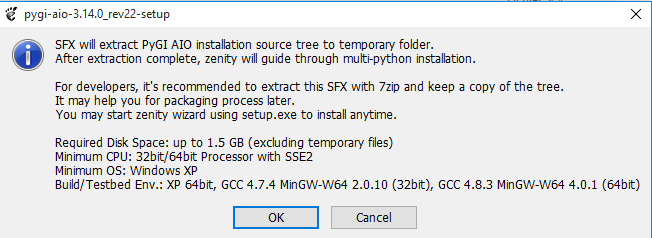
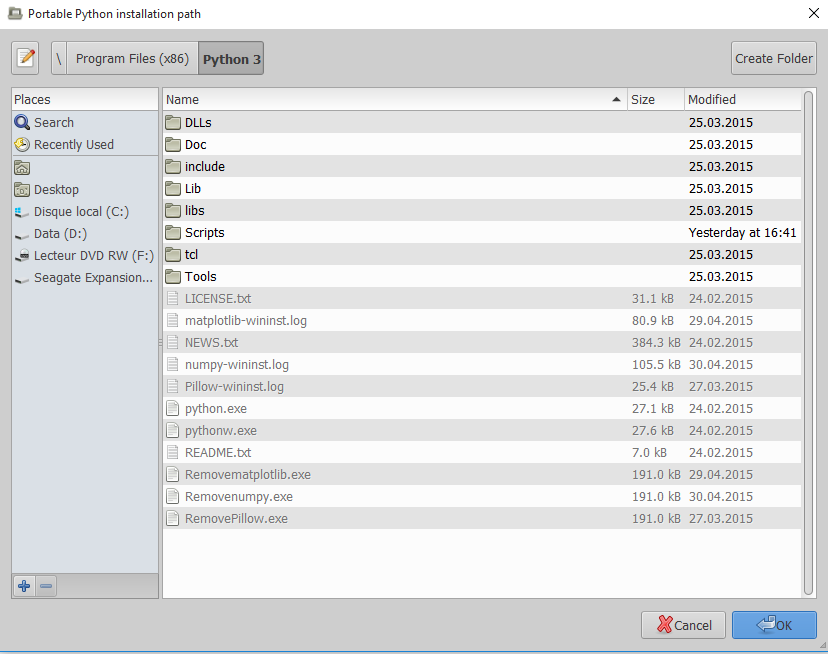
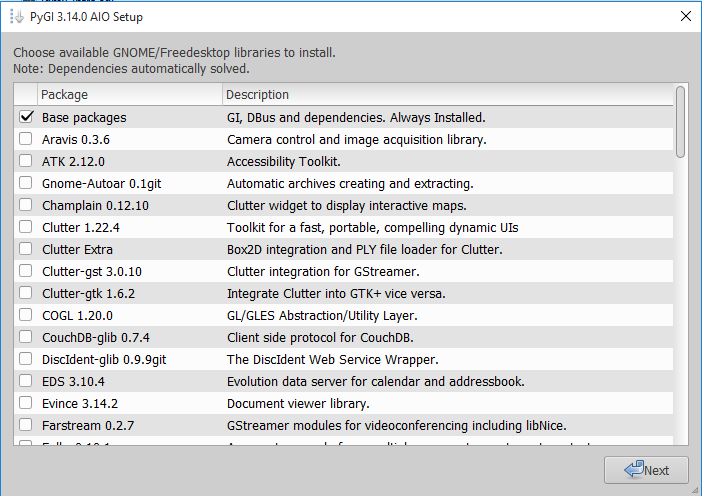

============
Installation
============

Comme précisé dans l'introduction, OpenPlane se veut multi-plateforme.
Seulement, et pour le moment, l'installation n'a été réalisée uniquement sous
Ubuntu et Windows.

Si vous arrivez à l'installer sous Mac OS X, il serait bien que vous me dites
comment vous avez fait afin de compléter cette partie.

Choisissez votre plate-forme favorite :

- Linux_
- Windows_

.. _Linux:

Sous Linux
----------
.. highlight:: bash

Comme vous allez le voir, c'est relativement simple.

Commencez par ouvrir un terminal et mettez vos dépôts à jour :
::
    sudo apt-get update

Installez ensuite les dépendances nécessaires :
::
    sudo apt-get install python3-gi python3-matplotlib git

Puis, clonez OpenPlane :
::
    git clone https://github.com/boopr/OpenPlane.git

Vous pouvez désormais lancer le programme :
::
    cd OpenPlane
    python3 app.py

.. _Windows:

Sous Windows
------------
Je remercie WinXaito_
d'avoir effectué l'installation d'OpenPlane sous Windows et les screenshots
qui suivent.

Commencez par télécharger `Python 3.X <https://www.python.org/downloads/windows/>`_
si vous ne l'avez pas encore sur votre ordinateur. Procédez à son installation.

Ensuite, téléchargez `PyGObject à cette adresse <http://sourceforge.net/projects/pygobjectwin32/files/?source=navbar>`_.
Double cliquez sur l'exécutable, une fenêtre devrait apparaître, validez avec *Ok*.

PyGObject vous demande ensuite d'indiquer le chemin de votre installation Python 3.

.. image:: images/install_windows_2.png

Appuyez sur *Add path* et indiquez le dossier où Python 3 à été installé.

Dans la fenêtre suivante, bien cocher la case autrement ça ne fonctionnera pas.

.. image:: images/install_windows_4.png

Sélectionnez ensuite les parties de PyGObject que vous souhaitez installer.
OpenPlane a besoin de :

- Base packages
- GTK+ 3.14.15
- GtkGLExt 2.99.0git
- GTKSourceView 3.14.4

Enfin, terminez l'installation de façon classique.

On peut passer à l'installation d'OpenPlane.
Téléchargez OpenPlane `depuis le Github du projet <https://github.com/boopr/OpenPlane/archive/master.zip>`_.
Désarchivez-le et lancez le fichier *app.py*. Voilà, c'est finit !

.. _WinXaito: https://zestedesavoir.com/membres/voir/WinXaito/
