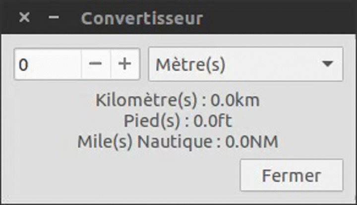

Convertisseur
=============

Introduction
------------

Le convertisseur est la première fenêtre à avoir été codée. Comme son nom l'indique,
elle permet de convertir des unités aéronautiques. Voici les différentes unités
supportées :

- Distance
    - Mètre (m)
    - Kilomètre (km)
    - Pied (ft)
    - Mille nautique (NM)
- Température
    - Degré Celsius (°C)
    - Degré Fahrenheit (°F)
    - Kelvin (K)

Utilisation
-----------
Le convertisseur est simple à utiliser. Entrez votre valeur dans la case prévue
à cet effet, ou alors, cliquez sur le bouton **+** pour incrémenter cette valeur
ou le bouton **-** pour la décrémenter.

Cliquez ensuite sur la liste déroulante à droite de cette zone de texte afin de
faire dérouler la liste des unités et sélectionnez celle correspondant à votre
valeur. Si l'unité vous convenait déjà, appuyez juste sur la touche *Entrée* de
votre clavier.

Le résultat de la conversion s'affiche alors dans les différentes unités compatibles
avec celle sélectionnée.
