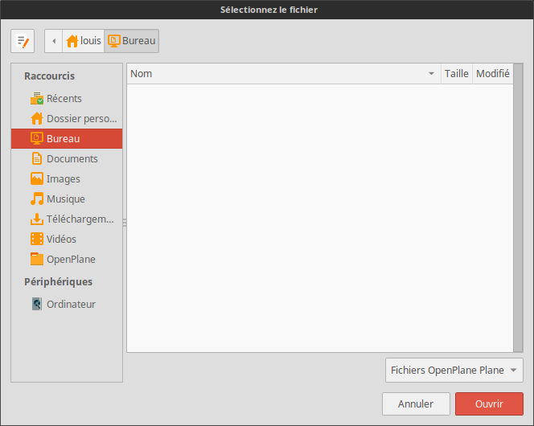

Le hangar
=========

Introduction
------------
Le hangar est une fenêtre clé. Il va vous permettre d’interagir avec vos
avions comme par exemple en créer un nouveau, en supprimer, en modifier,
en importer...

OpenPlane est fournit avec deux avions, *F-TEST* et *F-BTBB*. Vous pouvez donc
vous amusez à changer les réglages sur ces avions sans prendre de risque de perdre
vos avions personnels.

.. image:: ../images/hangar.png

Utilisation
-----------
La tableau liste les différents fichiers avions présents dans le dossier `openplane/datas/planes`.
Les colonnes sont ré-organisable (ordre alphabétique ou ordre alphabétique inversé).
Vous retrouverez votre avion par son immatriculation qui est unique. C'est en effet grâce
à celle-ci qu'OpenPlane différencie les avions.

Le bouton **Nouveau** en haut à gauche vous permet de créer un nouvel avion. Il
ouvre `l'éditeur d'avion <plane_editor.html>`_.

De même, le bouton **Modifier** ouvre `l'éditeur d'avion <plane_editor.html>`_ mais
en y important les valeurs de l'avion sélectionné précédemment. En effet, ce bouton
ne s'active si et seulement si un avion est sélectionné.

Le bouton **Supprimer** permet de supprimer l'avion sélectionné. Attention, il n'y a
pas de pop-up pour vous demander si vous voulez confirmer la suppression.

Le bouton **Ajouter** vous permet d'importer un fichier *.opp*. Vous pouvez en effet
partager vos avions et importer ceux des autres. Cette fonctionnalité est très utile,
notamment pour les aéro-clubs. En cliquant sur ce bouton, une pop-up apparaît vous
invitant à aller chercher le fichier de l'avion.

Un fichier *OpenPlane Plane* est en faite un fichier **.opp**.

Enfin, les deux derniers boutons permettent soit de fermer le hangar avec **Fermer** ou
alors de sélectionner un avion avec **Valider**. Ce dernier ne s'active que si le hangar
est utilisé comme un sélectionneur d'avion. Vous pourrez retrouver un exemple de cette
utilisation dans le `carnet de vol <logbook.html>`_.
