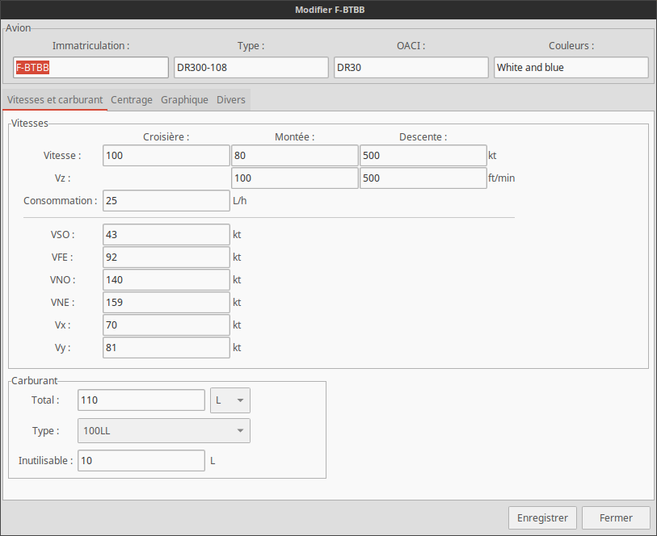
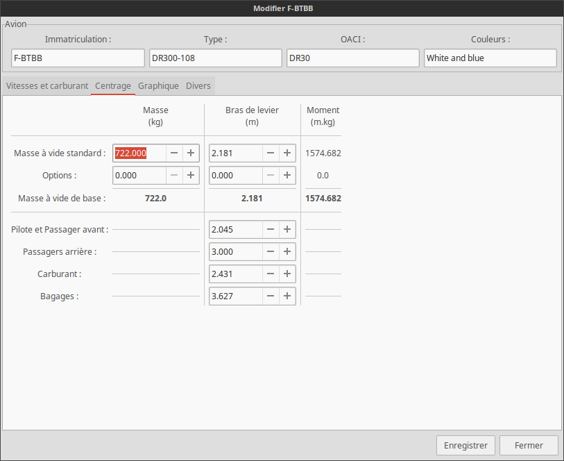
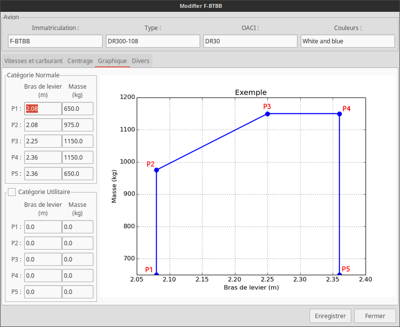

L'éditeur d'avion
=================

Introduction
------------
L'éditeur d'avion va vous permettre de donner toutes les caractéristiques de votre
avion afin de réaliser des devis de masse et centrage, de remplir votre carnet de vol...

Il se compose de quatre *onglets* que nous allons aborder ici.

Sachez que vous devez absolument indiquer l'immatriculation de l'avion, sinon il ne sera
pas sauvegardé.

L'éditeur d'avion peut être ouvert de deux façon. Soit pour créer un nouvel avion, dans ce
cas, les valeurs seront vide et ce sera à vous de toutes les remplir. Ou alors, pour
éditer un avion, les valeurs seront donc importées et vous pourrez modifier comme bon vous
semble votre avion.

En ouvrant l'éditeur d'avion, une fenêtre comme celle-ci devrait s'ouvrir :

Ne prenez pas peur devant la quantité de zone à remplir !

Vous remarquez donc ici qu'un avion à été importé. Dans le cas contraire, les cases
auraient été vides.

Utilisation
-----------

Seul les onglets **Centrage** et **Graphique** sont nécessaires pour le devis de masse et
centrage. Le premier ressemble à ça :

Ce tableau est à remplir entièrement pour le devis. Les différentes valeurs sont fournies
avec les documents de votre avion.

Le deuxième onglet concerne directement le graphique de masse et centrage. Voici à quoi il
ressemble :

L'image de droite vous présente les différents points à renseigner. La zone de gauche vous
permet de justement entrer la valeur de ces points. En commençant, de gauche à droite, par
l'abscisse puis l'ordonnée.

Il en va de même pour la catégorie utilitaire. Si vous ne l'utiliser pas, pensez à la
désactiver grâce à la petite case à cocher.

Le premier onglet et le denier étant totalement facultatif et facile à utiliser,
je ne les détaillerais pas.

