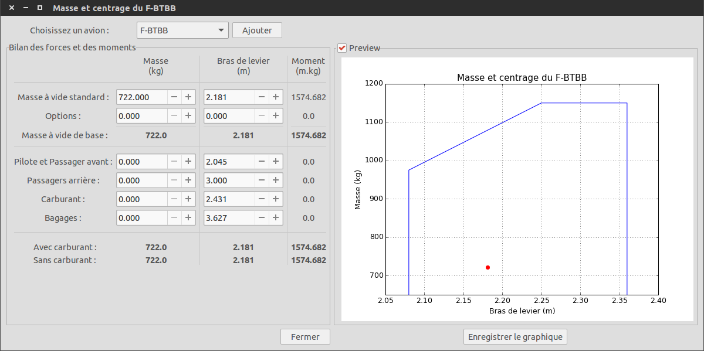
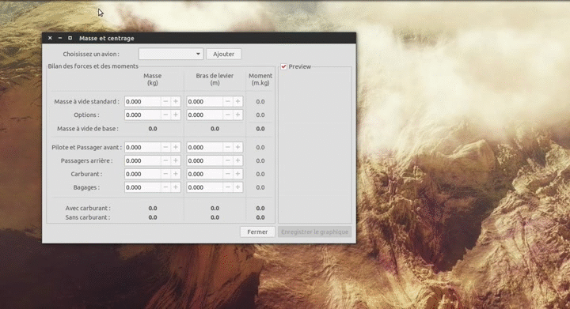
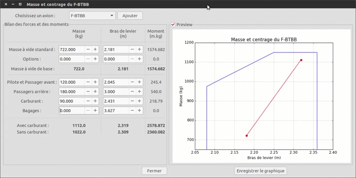

Masse et centrage
=================

Introduction
------------

La fenêtre de masse et centrage vous permet de calculer les moments de votre
avion, les visualiser dans un graphique afin de voir si vous êtes bien dans le
domaine d'utilisation de votre appareil.

Pour pouvoir être utilisée, cette fenêtre requière que vous ayez complété
correctement les informations de votre avion. Pour plus d'information,
rendez-vous dans `le manuel d'utilisation de l'éditeur d'avion <plane_editor.html>`_.

Utilisation
-----------

Une fois la fenêtre ouverte, sélectionner votre avion dans la liste déroulante,
en haut. À droite de cette liste se trouve un accès vers le `hangar <hangar.html>`_
afin de pouvoir modifier rapidement vos avions avant de faire votre devis.

En sélectionnant votre avion, la fenêtre devrait se remplir avec les valeurs de
celui-ci.

Vous pouvez modifier n'importe quelle valeur dans ce tableau, elles ne seront
pas sauvegardées. Au fur et à mesure que vous entrez les paramètres de votre vol,
le graphique se met à jour. Si cette mise à jour consomme trop de ressource sur
votre ordinateur, ou que vous n'en voyez pas l'utilité, n'hésitez pas à la
désactiver grâce à la case à cocher **Preview**.

Si vous ne respectez pas le domaine d'utilisation de l'avion, le graphique vous
l'indiquera clairement en changeant la couleur du cadre de ce domaine.

Vous pouvez également exporter ce graphique grâce au bouton **Enregistrer le
graphique**. Je conseille fortement le *.png* comme format d'image.